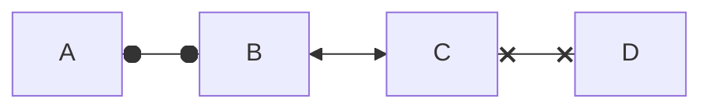
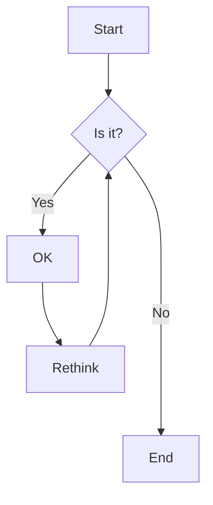
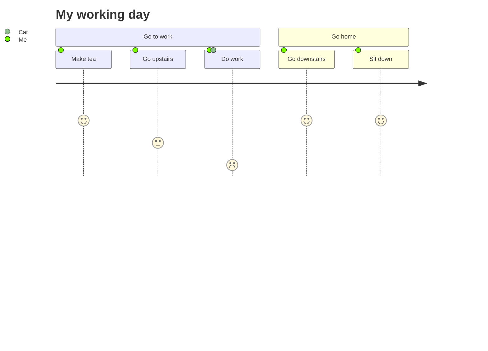

## Diagrams

Examples taken from [Mermaid flowchart diagram documentation](https://mermaid.js.org/syntax/flowchart.html)

Example taken from [Mermaid user journey diagram documentation](https://mermaid.js.org/syntax/userJourney.html#user-journey-diagram)

